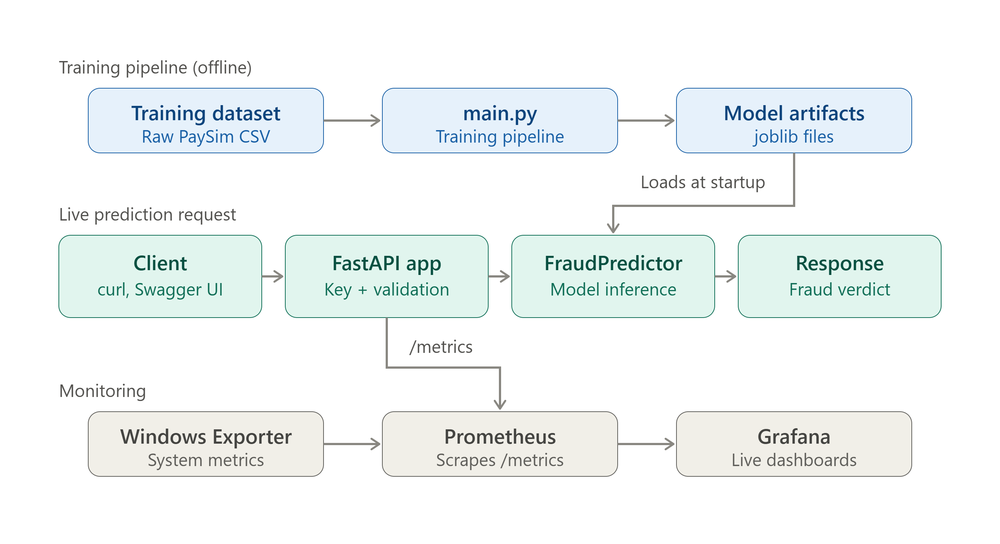

# Real-Time Financial Fraud Detection Pipeline

An end-to-end machine learning pipeline for detecting fraudulent financial transactions using the PaySim synthetic dataset. The pipeline trains, evaluates, and compares multiple classifiers with two imbalance-handling strategies, then persists the best model for production inference.

## Performance

| Model | Precision | Recall | F1-Score | ROC-AUC | PR-AUC |
|---|---|---|---|---|---|
| **Random Forest (class_weight)** | **1.0000** | **0.9781** | **0.9889** | 0.9934 | 0.9845 |
| XGBoost (SMOTE) | 0.9955 | 0.9781 | 0.9867 | 0.9975 | 0.9808 |
| XGBoost (class_weight) | 0.9738 | 0.9781 | 0.9759 | 0.9979 | 0.9839 |
| Random Forest (SMOTE) | 0.9612 | 0.9781 | 0.9697 | 0.9970 | 0.9846 |
| Logistic Regression (SMOTE) | 0.8884 | 0.9781 | 0.9311 | 0.9958 | 0.9774 |
| Logistic Regression (class_weight) | 0.1056 | 0.9781 | 0.1905 | 0.9961 | 0.9544 |

**Best model:** Random Forest (class_weight) — F1 = 0.9889, Optimal threshold = 0.379

## Architecture

```
main.py                          Pipeline orchestrator (13-step workflow)
src/
  preprocessing.py               Data loading, cleaning, encoding, scaling
  feature_engineering.py          Domain-specific feature creation (9 features)
  train_model.py                  Model configuration, training, SMOTE oversampling
  evaluate.py                    Evaluation, threshold optimisation, plots, report
  predict.py                     FraudPredictor class for production inference
```

### Pipeline Stages

```
Load CSV -> Clean -> Engineer Features -> Encode -> Split -> Scale
  -> Pipeline A: Train with class_weight (LR, RF, XGBoost)
  -> Pipeline B: Train with SMOTE       (LR, RF, XGBoost)
  -> Compare all 6 models -> Select best by F1
  -> Optimise threshold -> Extract feature importance
  -> Save artifacts -> Generate plots + report
```

## Setup

**Requirements:** Python 3.10+

```bash
git clone <repo-url>
cd Real-Time-Financial-Fraud-Detection-Pipeline
pip install -r requirements.txt
```

Place the dataset at `data/transactions_train.csv`.

## Usage

### Train the pipeline

```bash
python main.py
```

This runs the full 13-step pipeline and produces all artifacts in `models/`.

### Predict fraud on new transactions

```python
from src.predict import FraudPredictor

predictor = FraudPredictor(model_dir="models")

result = predictor.predict({
    "step": 1,
    "type": "TRANSFER",
    "amount": 181.0,
    "nameOrig": "C1305486145",
    "oldbalanceOrig": 181.0,
    "newbalanceOrig": 0.0,
    "nameDest": "C553264065",
    "oldbalanceDest": 0.0,
    "newbalanceDest": 0.0,
})
# result -> {"is_fraud": True, "probability": 0.92, "threshold": 0.379}
```

### Batch prediction

```python
import pandas as pd
from src.predict import FraudPredictor

predictor = FraudPredictor(model_dir="models")
df = pd.read_csv("new_transactions.csv")
results = predictor.predict_batch(df)
# Adds fraud_probability and fraud_prediction columns
```

## Generated Artifacts

| File | Description |
|---|---|
| `models/best_model.joblib` | Trained Random Forest classifier |
| `models/label_encoder.joblib` | Fitted LabelEncoder for `type` column |
| `models/standard_scaler.joblib` | Fitted StandardScaler (16 features) |
| `models/feature_names.joblib` | Ordered list of feature column names |
| `models/optimal_threshold.joblib` | Optimised classification threshold |
| `models/confusion_matrices.png` | Confusion matrices for all 6 models |
| `models/feature_importance.png` | Feature importance bar chart |
| `models/training.log` | Full pipeline execution log |
| `training_report.md` | Auto-generated Markdown training report |

## Engineered Features

| Feature | Description |
|---|---|
| `balance_delta_orig` | Sender balance change |
| `balance_delta_dest` | Receiver balance change |
| `orig_balance_zeroed` | 1 if sender balance drained to zero |
| `balance_mismatch_orig` | 1 if origin balance change != -amount |
| `balance_mismatch_dest` | 1 if destination balance change != +amount |
| `amount_log` | log1p(amount) — reduces skew |
| `amount_ratio_orig` | amount / (oldbalanceOrig + 1) |
| `hour_of_day` | step % 24 — captures diurnal patterns |
| `is_fraud_prone_type` | 1 if type is TRANSFER or CASH_OUT |

## Tech Stack

- **Python 3.13** — Core language
- **pandas 3.0** — Data manipulation
- **scikit-learn 1.9** — ML models, preprocessing, evaluation
- **XGBoost 3.3** — Gradient boosting classifier
- **imbalanced-learn 0.14** — SMOTE oversampling
- **matplotlib / seaborn** — Visualisation
## Monitoring Setup (Week 4)

### Monitoring Stack

* **Grafana** — Used for creating real-time monitoring dashboards.
* **Prometheus** — Used for collecting and storing monitoring metrics.
* **Windows Exporter** — Used for collecting Windows system metrics such as CPU and memory usage.

### Local Access

**Grafana Dashboard:**
http://localhost:3000

**Prometheus Server:**
http://localhost:9090

### Configuration Status

* Grafana installed and configured successfully.
* Prometheus installed and running successfully.
* Prometheus connected as a Grafana data source.
* FastAPI monitoring integration added using `prometheus_fastapi_instrumentator`.
* `/` and `/health` monitoring endpoints created.
* Windows Exporter configured on port `9182` with `cpu`, `memory`, `os`, `net`, `logical_disk`, and `system` collectors enabled.
* Prometheus configured to scrape Windows Exporter metrics.
* Prometheus configured to scrape FastAPI metrics on port `8000`.
* `windows-exporter`, `prometheus`, and `fastapi` targets all verified as **UP** in Prometheus.
* Grafana dashboard built and saved with live panels for CPU Usage, Memory Usage, and Fraud API Health.
* Dashboard configuration exported and version-controlled as `dashboard.json`.
* Monitoring setup completed for real-time visualization of fraud detection and system performance metrics.

### Grafana Dashboard

**File:** `dashboard.json`
**Screenshot:** `Monitoring_Dashboard.jpeg`

**Panels included:**

| Panel | Metric Source | Query |
|---|---|---|
| CPU Usage (%) | Windows Exporter | `100 - (avg(rate(windows_cpu_time_total{mode="idle"}[5m])) * 100)` |
| Memory Usage (%) | Windows Exporter | `(1 - (windows_memory_physical_free_bytes / windows_memory_physical_total_bytes)) * 100` |
| Fraud API Health | FastAPI (`prometheus_fastapi_instrumentator`) | `up{job="fastapi"}` |

**To restore this dashboard:**
1. Open Grafana → **Dashboards** → **New** → **Import**
2. Upload `dashboard.json`
3. Select **Prometheus** as the data source when prompted


## Fraud Prediction API (Week 4)

### Overview

The FastAPI application now serves live fraud predictions in addition to
health/monitoring endpoints. Predictions are powered by the trained
`Random Forest` model (see `models/best_model.joblib`), loaded once at
application startup for low-latency responses.

### Setup — Generating the Model Artifacts

Model files (`models/*.joblib`) are **not committed to this repository**
(see `.gitignore`) since they are large, reproducible binaries. To run the
API locally, generate them yourself:

1. Obtain the PaySim dataset (`transactions_train.csv`) and place it at:
   ```
   data/transactions_train.csv
   ```
2. Install dependencies:
   ```
   pip install -r requirements.txt
   ```
3. Run the training pipeline:
   ```
   python main.py
   ```
   This produces `models/best_model.joblib`, `label_encoder.joblib`,
   `standard_scaler.joblib`, `feature_names.joblib`, and
   `optimal_threshold.joblib`.

### Running the API

```
uvicorn fraud_monitoring_app:app --reload
```

Interactive API docs (Swagger UI): http://127.0.0.1:8000/docs

### Endpoints

| Endpoint | Method | Description |
|---|---|---|
| `/` | GET | API status message |
| `/health` | GET | Health check |
| `/predict` | POST | Predict fraud for a single transaction |
| `/predict/batch` | POST | Predict fraud for a batch of transactions |
| `/metrics` | GET | Prometheus metrics (auto-exposed) |

### Example — `/predict`

**Request:**
```json
{
  "step": 1,
  "type": "TRANSFER",
  "amount": 181,
  "nameOrig": "C1305486145",
  "oldbalanceOrig": 181,
  "newbalanceOrig": 0,
  "nameDest": "C553264065",
  "oldbalanceDest": 0,
  "newbalanceDest": 0
}
```

**Response:**
```json
{
  "is_fraud": true,
  "probability": 1.0,
  "threshold": 0.379
}
```

### Model Performance

| Metric | Value |
|---|---|
| Model | Random Forest (class_weight) |
| F1-Score | 0.9889 |
| Precision | 1.0000 |
| Recall | 0.9781 |
| Optimal Threshold | 0.379 |

Full training report: `training_report.md` (generated locally after running
`main.py`, not committed — see `.gitignore`).

## Authentication

`/predict` and `/predict/batch` require an API key, passed via the
`X-API-Key` header. `/`, `/health`, and `/metrics` remain open (no key
required) since they're used by health checks and Prometheus scraping.

### Setup

1. Copy `.env.example` to `.env`:
2. Edit `.env` and set a real secret value for `FRAUD_API_KEY`.
3. **Never commit `.env`** — it's excluded via `.gitignore`.

### Example request with authentication

```powershell
$headers = @{ "X-API-Key" = "<your-key>"; "Content-Type" = "application/json" }
$body = '{"step":1,"type":"TRANSFER","amount":181,"nameOrig":"C1305486145","oldbalanceOrig":181,"newbalanceOrig":0,"nameDest":"C553264065","oldbalanceDest":0,"newbalanceDest":0}'
Invoke-RestMethod -Uri "http://127.0.0.1:8000/predict" -Method Post -Headers $headers -Body $body
```

Requests without a valid key receive `401 Unauthorized`.

### Input validation

In addition to type/range checks, the API enforces business rules:

* `amount` must be greater than 0
* `nameOrig` and `nameDest` cannot be the same account
* `amount` cannot exceed a sanity cap (100,000,000)

Invalid requests receive `422 Unprocessable Entity` with details on which
rule failed.

## Running with Docker

The API can run in a container, independent of the host machine's Python
setup.

### Prerequisites

* [Docker Desktop](https://www.docker.com/products/docker-desktop/) installed
  and running
* Model artifacts generated locally first (`python main.py` — see setup
  steps above), since `models/` is not committed to the repo but **is**
  included in the Docker image at build time

### Build the image
### Run the container

* `-p 8000:8000` maps container port 8000 to your machine's port 8000
* `--env-file .env` passes `FRAUD_API_KEY` and other secrets into the
  container (the `.env` file itself is excluded from the image via
  `.dockerignore`)

The API is then available at `http://127.0.0.1:8000`, identical to running
it locally.

### Stop and remove the container

## System Architecture



The pipeline has two flows:

1. **Training (offline)** — `main.py` reads the raw PaySim dataset, runs the
   full 13-step pipeline, and saves model artifacts to `models/`.
2. **Live prediction (online)** — Client requests hit the FastAPI app, pass
   through API key authentication and input validation, then get scored by
   `FraudPredictor` (loaded from the artifacts above) and return a fraud
   verdict.

The FastAPI app also exposes `/metrics`, scraped by Prometheus (along with
Windows Exporter for system metrics) and visualized in Grafana — see
[Monitoring Setup](#monitoring-setup-week-4) below.

**Full API reference:** see [`API_DOCS.md`](API_DOCS.md) for every endpoint,
request/response schema, and error code.

---

# Version 1.0 Release 

The first stable version of the Real-Time Financial Fraud Detection Pipeline has been released.

## Release Information

- **Version:** v1.0
- **Release Type:** Initial stable release
- **Status:** Completed

This release marks the completion of the end-to-end fraud detection pipeline, including machine learning model development, API implementation, monitoring setup, and project documentation.

## GitHub Version Control

A version tag was created and pushed to GitHub:v1.0

This provides a fixed reference point for the completed project version and enables easier tracking of future updates and improvements.

## Final Repository Status

The repository now contains:

- Complete fraud detection pipeline
- Production-ready API implementation
- Monitoring configuration
- Documentation
- Version-controlled project release

---

---

# API Automated Testing

Automated tests were implemented for the Fraud Detection API using **FastAPI TestClient** and **pytest**.

The test suite validates API functionality without requiring a separate Uvicorn server, by running the application in-process.

## Running API Tests

Before running tests, ensure that model artifacts are generated:

```bash
python main.py

